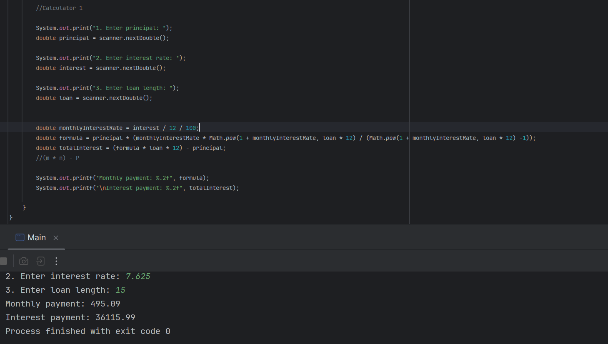
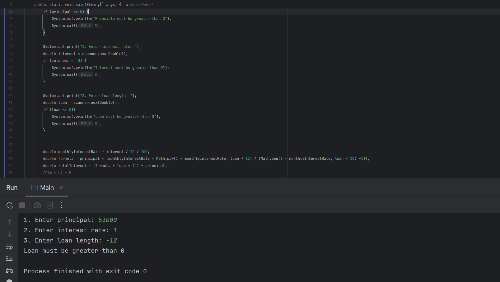
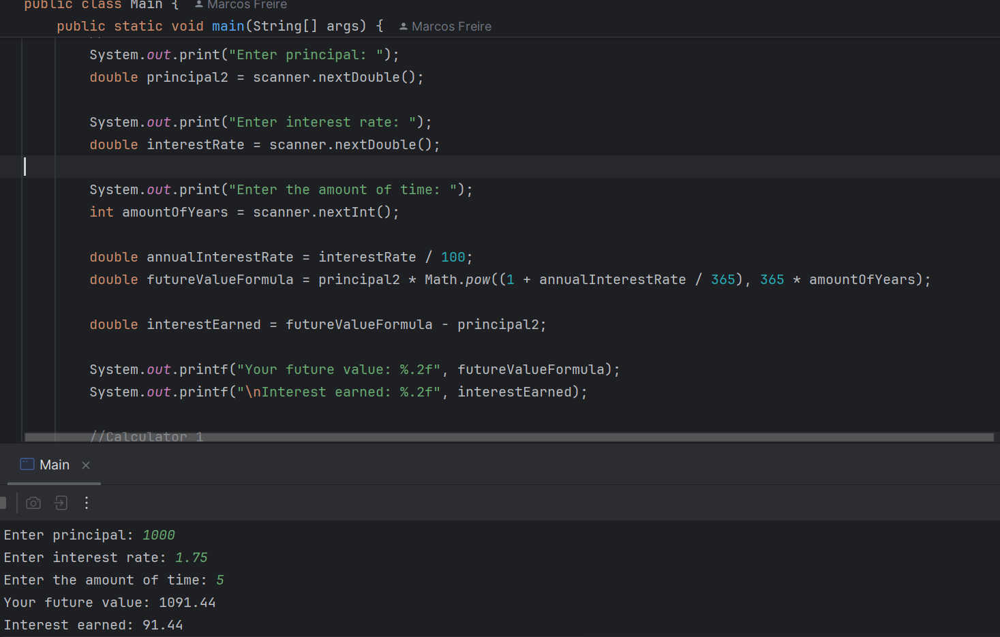
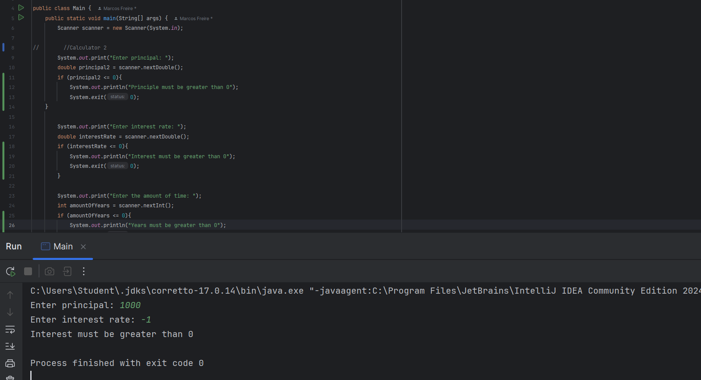

# Financial Calculator

# Mortgage Calculator

So in the mortgage calculator we used the formula: 
M=P*(i*(1+i)^n / ((1+i) ^n)-1)

To find out how much their loan would make with 
a certain amount of interest and time 
would make over the years.

Users are able to insert their info thanks to the use of scanners. We also took the time to write the formula thanks 
to the help of Math.pow()

# Future Value Calculator

For future value we used:
FV = P × (1 + (r / 365))^(365 × t)

To determine how much money is earned within a certain amount of time. 

double formula = principal * (monthlyInterestRate * Math.pow(1 + monthlyInterestRate, loan * 12) / (Math.pow(1 + monthlyInterestRate, loan * 12) -1));
What I found interesting about this line of code is how we can use it for when we want to find out 
how much we'll make overtime without the need of going to someone for help when we can build the calculator ourselves.

